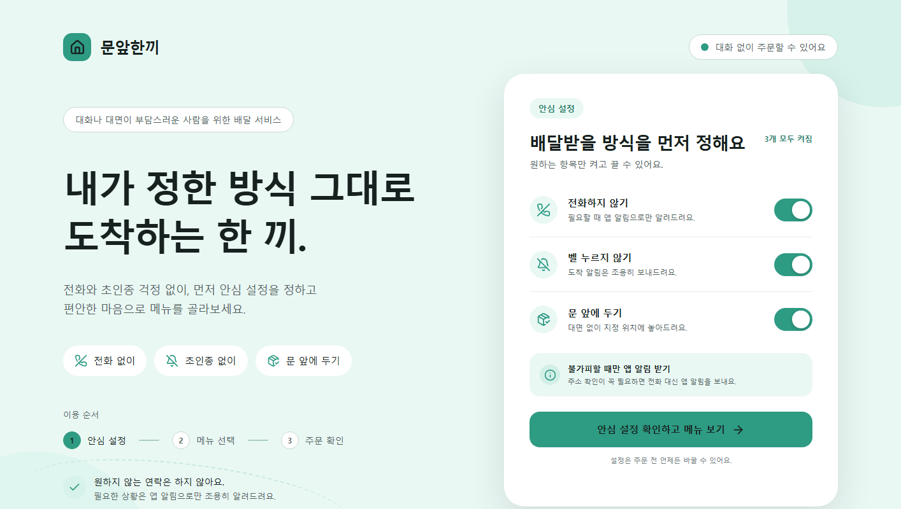

# 문앞한끼

전화나 대면이 부담스러운 사용자가 원하는 배달 방식을 먼저 정한 뒤 식사를 주문할 수 있도록 기획한 데스크톱 웹 프로토타입입니다.



## 핵심 기능

- 전화하지 않기, 벨 누르지 않기, 문 앞에 두기 설정
- Mock 데이터로 구성한 메뉴 4개 선택
- 식사 양과 음료 옵션 변경
- 수량 조절과 장바구니 추가 및 삭제
- 주문 확인, 처리 중, 주문 완료 화면 연결
- 상세 주소 확인이 필요한 경우 전화 대신 앱 알림 표시

## 실행 방법

```bash
pnpm install
pnpm dev
```

프로덕션 빌드는 다음 명령으로 확인할 수 있습니다.

```bash
pnpm build
```

## 기술 구성

- Vite
- React
- JavaScript와 JSX
- CSS
- Lucide React
- Mock JavaScript 배열

## 상태와 화면 연결

`useState`로 현재 단계, 안심 설정, 선택 메뉴, 옵션, 수량, 장바구니, 앱 알림 확인 상태를 관리합니다. React Router 없이 `currentStep`과 조건부 렌더링으로 다음 흐름을 연결했습니다.

안심 설정 → 메뉴 선택 → 주문 확인 → 처리 중 → 주문 완료

## 결과물

- [GitHub 저장소](https://github.com/Wintevel/munap-hankki)
- [Figma 메인 화면](https://www.figma.com/design/0yrs9wRxhijR9HJQ9TllIb)
- [Notion 기획 및 구현 설명](https://app.notion.com/p/3a0ec30a6eb881748b76f4fcef65945a)
- [전체 기획 문서](docs/notion-draft.md)

## 구현 범위

서버, SQLite, 실제 결제와 실제 주문 전송은 구현하지 않았습니다. API, HTTP 메서드, JSON, SQLite 항목은 Notion 문서에서 개념 설계로만 설명합니다. Figma 결과물은 정적 메인 화면이며 Prototype과 재사용 가능한 Variant는 제작하지 않았습니다.
